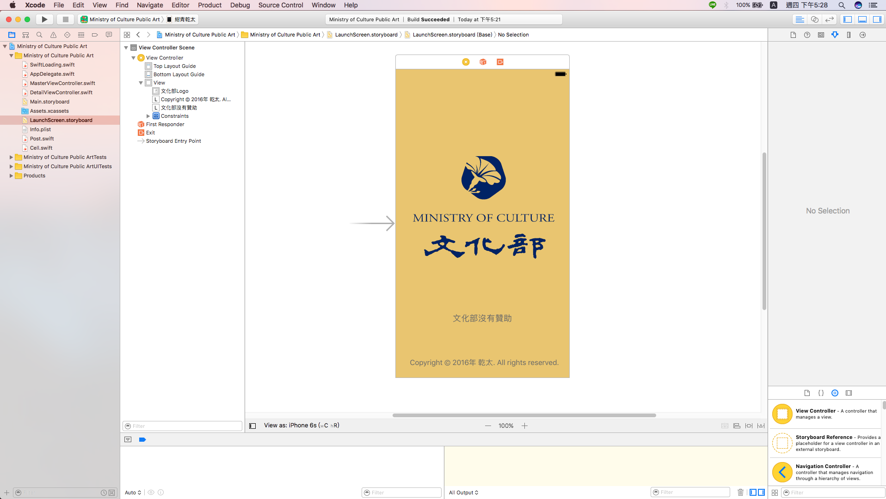
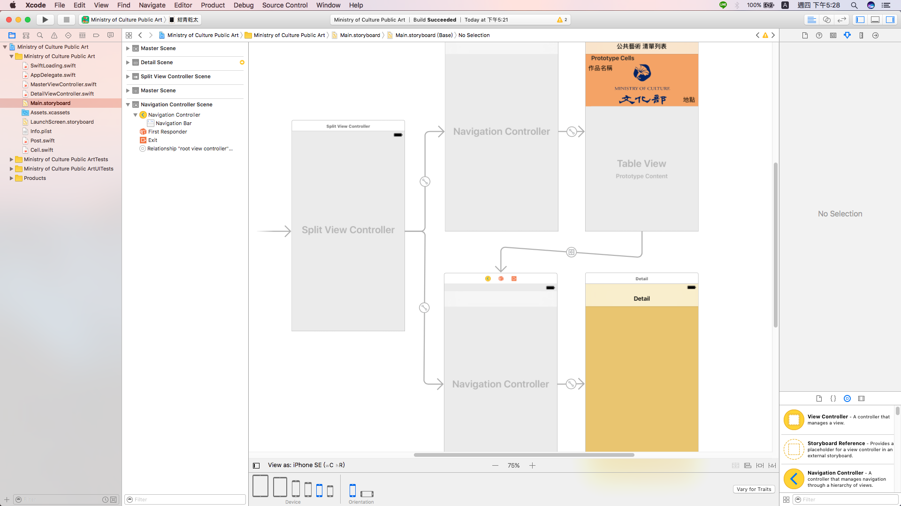
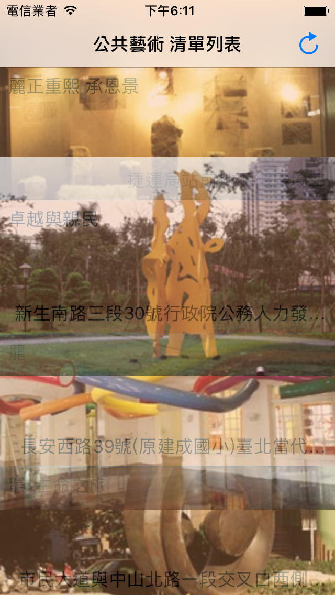
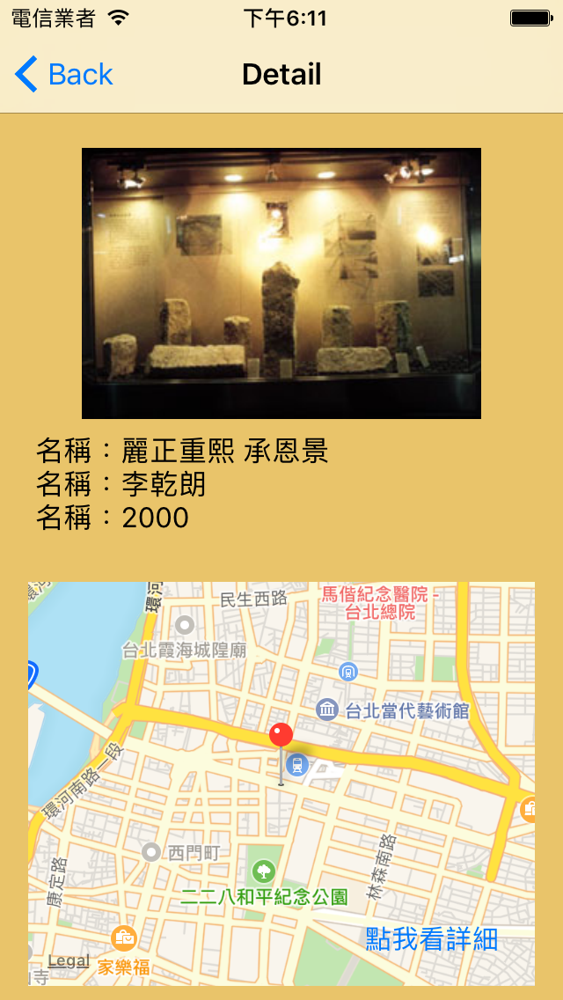
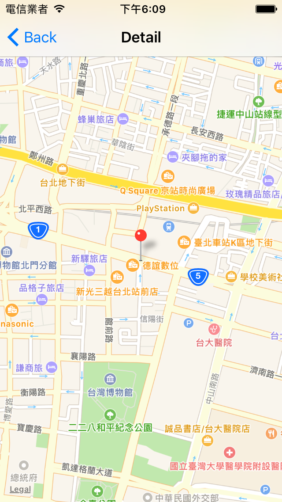

# 文化部公共藝術 Swift Application
這是一項在上 iOS 程式設計時，所做的微小作業，透過抓取政府資料開放平臺 [政府資料開放平臺](http://data.gov.tw "政府資料開放平臺") 的 Json 資料，並且解析後，以 TableView Show 出預覽畫面，最後結合 Apple Map 將地點詳細顯示。

### ！注意！作者聲明
###### (1) 程式碼沒重構過，所以是智障寫法，極度不建議當作學習指標。
###### (2) 因此建議看 README.md 就好，會把該 App 的一些重要語法給列出。

### 開始畫面的 Storyboard 設計
# 

### 應用程式畫面的 Storyboard 設計
# 

### 首頁執行畫面
# 

### 選擇藝術品
# 

### 詳細地點顯示
# 

### 如果你要上網下載 Json 資料，你要記得在 info.plist 加入：
> App Transport Security Settings -> Allow Arbitrary Loads -> YES

### 如果你要取用 GPS 資料，你要記得在 info.plist 加入：
> NSLocationWhenInUsageDescription -> Message

### 異步更新 UIImageView 的方法
```Swift
func loadImageFromUrl(url: String, view: UIImageView){
    // Create Url from string
    let url = NSURL(string: url)!
    let task = URLSession.shared.dataTask(with: url as URL) { (responseData, responseUrl, error) -> Void in
        if let data = responseData{
            // execute in UI thread
            DispatchQueue.main.async(execute: { () -> Void in
                view.image = UIImage(data: data)
            })
        }
    }
    task.resume()
}
```

### 設定圖片顯示樣式、透明度的方法
```Swift
self.imagwView?.contentMode = UIViewContentMode
self.imagwView?.alpha = Double
```

### 異步透過連線方式下載 Json 資料的方法
```Swift
let _mainHttpPath = "Your_Http_Path"
let request = NSURLRequest(url: NSURL(string: _mainHttpPath)! as URL)
let urlSession = URLSession.shared
let task = urlSession.dataTask(
    with: request as URLRequest,
    completionHandler: {
        (data, responsem, error) -> Void in
        SwiftLoading.shared.hideOverlayView()
        let httpResponse = responsem as? HTTPURLResponse
        if error != nil {
            print(error!.localizedDescription)
        } else {
            // Code ...
        }
    }
)
task.resume()
```

### 應用 GPS 必須先 import 的東西
```Swift
import MapKit
import CoreLocation
```

### 取得 GPS 權限的方法 之1
```Swift
func configureView() {
    locationManager.requestWhenInUseAuthorization()
    if CLLocationManager.authorizationStatus() == .notDetermined {
        locationManager.requestAlwaysAuthorization()
    } else if CLLocationManager.authorizationStatus() == .denied {
//            showAlert("Location services were previously denied. Please enable location services for this app in Settings.")
    } else if CLLocationManager.authorizationStatus() == .authorizedAlways {
        locationManager.startUpdatingLocation()
    }
}
```

### 取得 GPS 權限的方法 之2
```Swift
override func viewDidAppear(_ animated: Bool) {
    super.viewDidAppear(animated)
    
    // 首次使用 向使用者詢問定位自身位置權限
    if CLLocationManager.authorizationStatus() == .notDetermined {
        // 取得定位服務授權
        self.locationManager.requestWhenInUseAuthorization()
        
        // 開始定位自身位置
        self.locationManager.startUpdatingLocation()
    }
        // 使用者已經拒絕定位自身位置權限
    else if CLLocationManager.authorizationStatus() == .denied {
        // 提示可至[設定]中開啟權限
        let alertController = UIAlertController(
            title: "定位權限已關閉",
            message: "如要變更權限，請至 設定 > 隱私權 > 定位服務 開啟",
            preferredStyle: .alert
        )
        
        let okAction = UIAlertAction(
            title: "確認",
            style: .default,
            handler:nil
        )
        
        alertController.addAction(okAction)
        
        self.present(
            alertController,
            animated: true,
            completion: nil
        )
    
    // 使用者已經同意定位自身位置權限
    } else if CLLocationManager.authorizationStatus() == .authorizedWhenInUse {
        // 開始定位自身位置
        self.locationManager.startUpdatingLocation()
    }
}
```

### 開啟、關閉 GPS 功能的方法
```Swift
// 開啟 GPS 功能
self.locationManager.startUpdatingLocation()
// 關閉 GPS 功能
self.locationManager.stopUpdatingLocation()
```

### 另開一個 View 來顯示 Map
```Swift
@IBAction func mapClick(_ sender: AnyObject) {
    // 取得螢幕的尺寸
    let fullSize = UIScreen.main.bounds.size
    
    // 建立一個 MKMapView
    self.uimap = MKMapView(
        frame: CGRect(
            x: 0,
            y: 20,
            width: fullSize.width,
            height: fullSize.height - 20
        )
    )
    
    // 地圖樣式
    self.uimap.mapType = .standard
    
    // 顯示自身定位位置
    self.uimap.showsUserLocation = true
    
    // 允許縮放地圖
    self.uimap.isZoomEnabled = true
    
    // 地圖預設顯示的範圍大小 (數字越小越精確)
    let latDelta = 0.01
    let longDelta = 0.01
    let currentLocationSpan:MKCoordinateSpan =
        MKCoordinateSpanMake(latDelta, longDelta)
    
    // 設置地圖顯示的範圍與中心點座標
    let center:CLLocation = CLLocation(
        latitude: self.annLatitude, longitude: self.annLongitude)
    let currentRegion:MKCoordinateRegion =
        MKCoordinateRegion(
            center: center.coordinate,
            span: currentLocationSpan
        )
    self.uimap.setRegion(currentRegion, animated: true)
    
    // 建立一個地點圖示 (圖示預設為紅色大頭針)
    let objectAnnotation = MKPointAnnotation()
    objectAnnotation.coordinate = CLLocation(latitude: self.annLatitude, longitude: self.annLongitude).coordinate
    objectAnnotation.title = self.annTitle
    objectAnnotation.subtitle = self.annSubtitle
    uimap.addAnnotation(objectAnnotation)
    
    // 加入到畫面中
    self.view.addSubview(self.uimap)
}
```

### 在地圖上新增一個大頭針
```Swift
let objectAnnotation = MKPointAnnotation()
objectAnnotation.coordinate = CLLocation(
    latitude: self.annLatitude,
    longitude: self.annLongitude
).coordinate
objectAnnotation.title = self.annTitle
objectAnnotation.subtitle = self.annSubtitle
uimap.addAnnotation(objectAnnotation)
```

### 設定自身定位位址的精確度
```Swift
/* kCLLocationAccuracyBestForNavigation：精確度最高，適用於導航的定位。
 * kCLLocationAccuracyBest：精確度高。
 * kCLLocationAccuracyNearestTenMeters：精確度 10 公尺以內。
 * kCLLocationAccuracyHundredMeters：精確度 100 公尺以內。
 * kCLLocationAccuracyKilometer：精確度 1 公里以內。
 * kCLLocationAccuracyThreeKilometers：精確度 3 公里以內。
 */
```

### CLLocationManager()
```Swift
// 建立一個 CLLocationManager
self.locationManager = CLLocationManager();

// 設置委任對象
self.locationManager.delegate = self;

// 距離篩選器 用來設置移動多遠距離才觸發委任方法更新位置
self.locationManager.distanceFilter = kCLLocationAccuracyNearestTenMeters

// 取得自身定位位置的精確度
self.locationManager.desiredAccuracy = kCLLocationAccuracyThreeKilometers
```

### 如何把經緯度轉地址
```Swift
func geoCoderToCLGeo(latitude: Double, longitude: Double, label :UILabel) -> Void {
    let geoCoder = CLGeocoder()
    let currentLocation = CLLocation(latitude: latitude, longitude: longitude)
    geoCoder.reverseGeocodeLocation(currentLocation, completionHandler: {
        (placemarks, error) -> Void in
        if error != nil{
            // print(error)
            return
        }
        //name         街道地址
        //country      國家
        //province     省
        //locality     市
        //sublocality  縣.區
        //route        街道、路
        //streetNumber 門牌號碼
        //postalCode   郵遞區號
        if placemarks != nil && (placemarks?.count)! > 0{
            let placemark = (placemarks?[0])! as CLPlacemark
            //這邊拼湊轉回來的地址
            label.text = label.text! + placemark.name!
        }
    })
}
```